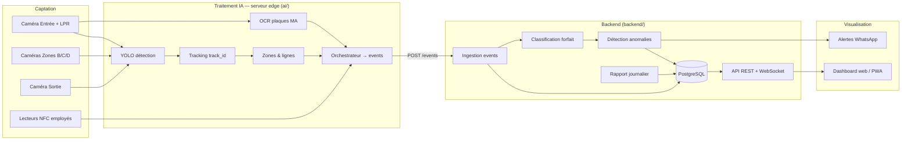
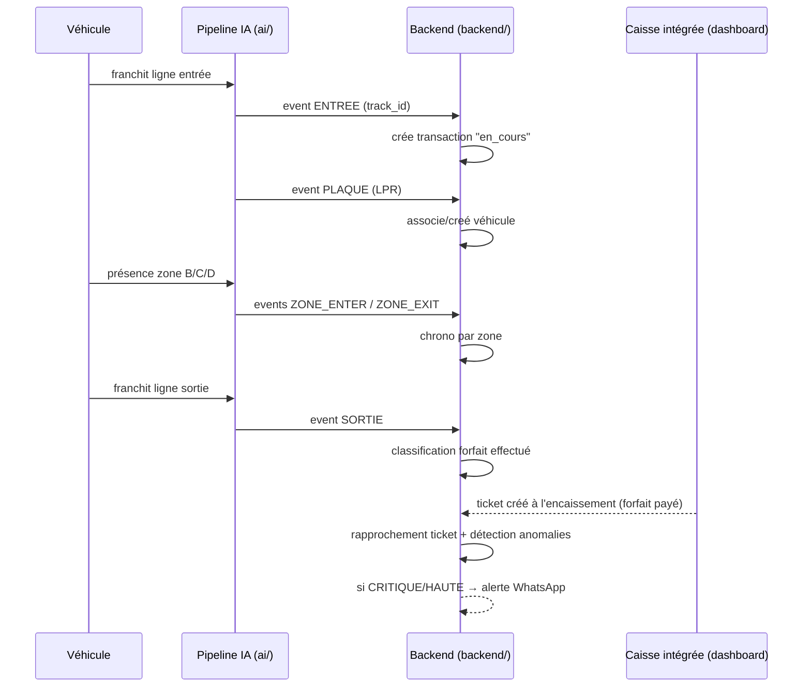

# Architecture — Wash Manager

## Vue d'ensemble (4 couches)

## Séquence — passage d'un véhicule

## Répartition des responsabilités

- **`ai/` ne fait que percevoir** : détecter, suivre, lire, situer. Aucune règle
  métier. Il émet des **faits** (events).
- **`backend/` décide** : construit les transactions, classe le forfait, applique
  les règles d'anomalies, produit les rapports, expose l'API.
- **`frontend/` affiche** : consomme l'API, ne contient pas de logique métier.

Ce découplage permet de développer/tester chaque couche indépendamment et de
déployer le pipeline IA sur une machine edge séparée du serveur applicatif.

## Interface pivot : les événements

Le contrat d'événement (`backend/app/schemas/event.py` ↔ `ai/pipeline/events.py`)
est le point d'intégration central. Toute évolution du pipeline (nouvelle zone,
nouveau capteur) passe par un nouveau type/champ d'événement, sans toucher au
reste.
